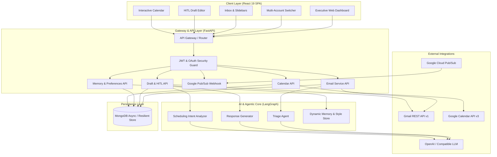
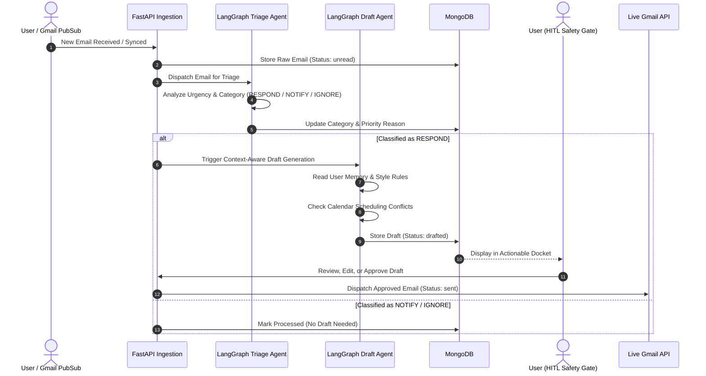

# AetherMail System Architecture

This document provides a comprehensive technical overview of the **AetherMail** architecture, including data flow pipelines, AI reasoning graphs, asynchronous sync mechanisms, security layers, and component interactions.

---

## 1. High-Level Architecture Overview

AetherMail is designed around an event-driven, micro-layered SaaS architecture:

---

## 2. Core Subsystems

### A. Frontend Layer (React 19 + Vite + Tailwind CSS)
- **Single Page Application (SPA)**: Powered by React 19, React Router v7, and Tailwind CSS.
- **Multi-Account Switcher**: Provides account isolation and unified inbox views across personal Gmail and corporate Workspace accounts.
- **Ergonomic Slidebar Navigation**: Collapsible email list and conversation inspection panels with zero horizontal text clipping.
- **Dynamic Live Polling & Cache**: Interacts with the backend via a centralized `apiClient` service with JWT bearer injection and reactive state hooks.

### B. Backend API & Ingestion Layer (FastAPI)
- **FastAPI Core**: Asynchronous ASGI framework handling concurrent HTTP requests and webhook payloads.
- **JWT & OAuth 2.0 Security**: Bcrypt-hashed password storage, JWT token issuance, and state-validated Google OAuth 2.0 token exchange with automatic offline refresh token handling.
- **Resilient Database Layer**: MongoDB async client (`motor`) coupled with a fail-safe in-memory cache to guarantee operational continuity even if database connectivity fluctuates.

### C. Agentic Core (LangGraph & Heuristic Reasoning)
The AI pipeline coordinates multi-step reasoning before producing any output:

### D. Google Cloud Pub/Sub Webhook Architecture
Replaces expensive polling with immediate push notifications:

1. **Watch Subscription**: The backend registers a watch subscription with Gmail API (`/users/me/watch`).
2. **Push Delivery**: When a message lands in the inbox, Gmail notifies the Google Cloud Pub/Sub topic.
3. **Webhook Ingestion**: Pub/Sub pushes the notification payload to `POST /api/webhooks/gmail/pubsub`.
4. **Targeted Delta Sync**: The backend extracts `historyId`, fetches only the newly arrived message delta, processes it through triage, and updates the UI in near real-time.

---

## 3. Data Models & Schemas

### Email Document Schema
| Field | Type | Description |
|---|---|---|
| `id` | String | Unique identifier (UUID or Gmail Message ID) |
| `user_id` | String | Owner identifier for multi-tenant isolation |
| `sender` | String | Sender name and address |
| `recipient` | String | Recipient address |
| `subject` | String | Subject line |
| `body` | String | Email body text / sanitized HTML |
| `timestamp` | DateTime | Timestamp of receipt/dispatch |
| `status` | String | `unread` \| `read` \| `drafted` \| `sent` \| `archived` |
| `category` | String | `respond` \| `notify` \| `ignore` |
| `reasoning` | String | AI explanation for the classification |
| `draft` | Object | Generated reply, proposed time slots, and confidence |
| `account_id` | String | Associated Google account (for multi-account support) |

### Memory & Preference Schema
| Field | Type | Description |
|---|---|---|
| `user_id` | String | Unique user reference |
| `sender_rules` | Map<String, String> | Custom VIP/Ignore directives per email/domain |
| `category_preferences` | Map<String, String> | Triage preferences based on topics or urgency |
| `response_style` | String | Formality, conciseness, sign-off style, and tone rules |
| `calendar_constraints`| Object | Working hours, buffer intervals, and meeting limits |

---

## 4. Security & Safety Principles

1. **Human-in-the-Loop (HITL) Guarantee**: No AI agent has permission to autonomously dispatch outbound emails without human approval. Every draft requires deliberate review, edit, or approval.
2. **Zero Plaintext Secrets**: OAuth credentials, JWT secrets, and API tokens are loaded exclusively through environment variables.
3. **CORS & CSRF Defenses**: Strict CORS policy configured for authorized domains and origins.
4. **Token Isolation**: Refresh tokens and access credentials are kept strictly isolated per user and per connected Google account.
